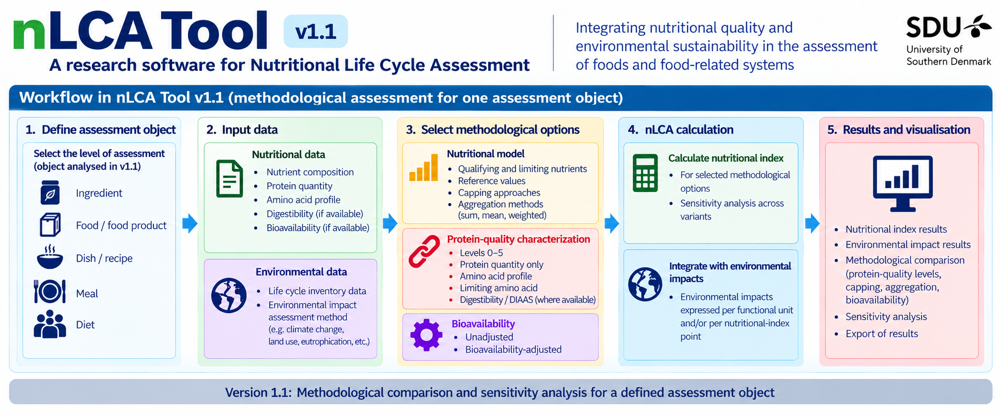
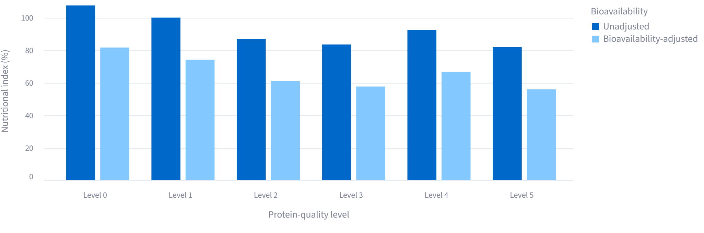
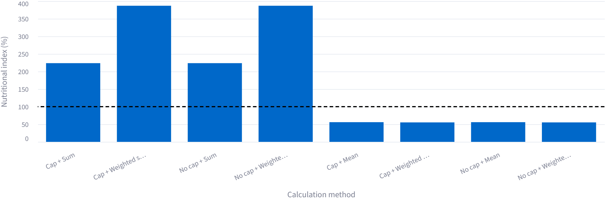
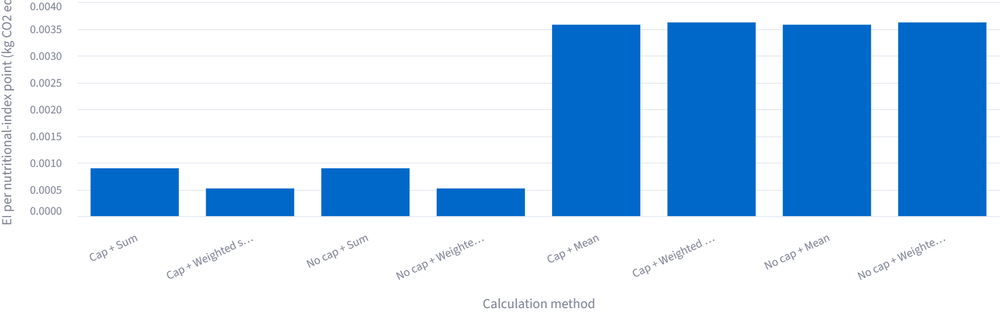

# nLCA Tool

**Research software for Nutritional Life Cycle Assessment**

**Version 1.1**

Developed by the **SMART Research Team, Center for Life Cycle Engineering, University of Southern Denmark (SDU)**.

---

## Overview

**nLCA Tool** is research software developed to support methodological implementation, comparison, and sensitivity analysis in **nutritional Life Cycle Assessment (nLCA)**.

Nutritional Life Cycle Assessment extends conventional environmental Life Cycle Assessment by incorporating nutritional characteristics into the assessment of foods and food-related systems. The nLCA Tool provides a structured computational environment for examining how alternative approaches to nutritional characterization affect nutritional indices and nutrition-adjusted environmental results.

Version 1.1 focuses particularly on methodological choices related to:

- nutrient-density assessment;
- protein quantity and protein-quality characterization;
- amino acid composition and amino acid digestibility;
- DIAAS-related protein-quality assessment;
- nutrient bioavailability;
- nutrient capping;
- alternative nutrient aggregation approaches;
- methodological sensitivity analysis; and
- integration of nutritional indices with environmental Life Cycle Assessment results.

The software is intended primarily for **research and methodological development** in nutritional Life Cycle Assessment, sustainable food-system assessment, and related fields.

---

## Conceptual framework

The overall structure of nLCA Tool Version 1.1 is illustrated below.

**Figure 1. Conceptual overview of nLCA Tool Version 1.1.**  
The tool links user-defined nutritional and environmental inventory data with alternative nutritional characterization approaches. Methodological choices concerning protein quality, nutrient bioavailability, capping, and aggregation can be evaluated systematically before nutritional results are integrated with environmental indicators. The framework supports comparison across methodological variants and sensitivity analysis.

---

## Scientific workflow

The general calculation workflow implemented in Version 1.1 can be represented as:

**Input data → Nutritional characterization → Protein-quality characterization → Bioavailability adjustment → Capping and aggregation → Nutritional index → Environmental integration → Sensitivity analysis and reporting**

This modular structure is intended to make methodological assumptions explicit and allow researchers to investigate their influence on nLCA results.

---

## Nutritional characterization

The tool supports nutrient-density based nutritional characterization in which selected qualifying and limiting nutrients can be evaluated relative to researcher-defined reference values.

Researchers can investigate alternative methodological assumptions rather than relying on a single fixed nutritional scoring approach.

Among the methodological dimensions that can be evaluated are:

- nutrient selection;
- nutrient reference values;
- treatment of qualifying and limiting nutrients;
- nutrient capping;
- aggregation by sum or mean;
- weighted aggregation approaches;
- nutrient bioavailability adjustment; and
- protein-quality characterization.

This allows the consequences of alternative nutritional modelling choices to be examined explicitly.

---

## Protein-quality characterization

Protein quality can be incorporated at different levels of methodological detail.

Version 1.1 implements a **six-level protein-quality framework, Levels 0 to 5**, allowing researchers to investigate how increasing levels of protein-quality characterization influence nutritional and nutrition-adjusted environmental results.

Depending on the selected level and available data, protein assessment can incorporate information related to:

- protein quantity;
- amino acid composition;
- amino acid reference patterns;
- limiting indispensable amino acids;
- protein or amino acid digestibility;
- amino acid scores; and
- DIAAS-related protein-quality characterization.

The multi-level structure also makes it possible to conduct cross-level sensitivity analyses.

### Example: comparison across protein-quality levels

**Figure 2. Example cross-level comparison generated by nLCA Tool.**  
Illustrative comparison of the nutritional index across protein-quality Levels 0 to 5, showing both unadjusted and bioavailability-adjusted results for a selected calculation method.

---

## Nutrient bioavailability

Version 1.1 allows nutrient bioavailability to be incorporated into nutritional characterization when appropriate data or researcher-defined assumptions are available.

Results can therefore be compared between:

- **unadjusted nutritional characterization**, and
- **bioavailability-adjusted nutritional characterization**.

This enables the researcher to quantify how assumptions concerning nutrient availability influence the resulting nutritional index.

### Example: bioavailability and calculation variants

**Figure 3. Example comparison of nutritional-index calculation variants.**  
The figure illustrates how the calculated nutritional index can change according to capping, aggregation, and bioavailability assumptions.

---

## Capping and nutrient aggregation

A major methodological question in nutrient-density assessment concerns how individual nutrient contributions are combined.

Version 1.1 supports alternative calculation variants involving combinations of:

- capping versus no capping;
- sum versus mean aggregation; and
- weighted aggregation approaches.

These alternatives can be evaluated under the same input dataset, allowing the influence of calculation structure to be examined directly.

### Example: calculation-method sensitivity

**Figure 4. Example sensitivity analysis across nutritional calculation methods.**  
Alternative capping and aggregation assumptions can produce substantially different nutritional-index values. The tool enables these methodological effects to be evaluated systematically rather than embedding them implicitly in a single calculation pathway.

---

## Methodological sensitivity analysis

A central purpose of nLCA Tool is to facilitate transparent investigation of **methodological sensitivity**.

Comparisons can be conducted across dimensions such as:

- protein-quality level;
- nutrient capping;
- aggregation method;
- weighting approach;
- nutrient bioavailability; and
- combinations of methodological assumptions.

This makes it possible to distinguish changes caused by the characteristics of the assessed object from changes caused by the methodological choices used to characterize nutritional quality.

---

## Integration with environmental Life Cycle Assessment

Environmental Life Cycle Assessment results can be integrated with the nutritional index calculated by the tool.

This enables environmental impacts to be expressed relative to nutritional performance, allowing researchers to investigate how nutritional characterization affects interpretation of environmental performance.

The tool is designed to preserve both the underlying environmental result and the nutritional characterization so that the effect of nutritional adjustment remains transparent.

### Example: nutrition-adjusted climate-change result

**Figure 5. Example environmental integration generated by nLCA Tool.**  
Climate-change impact expressed per nutritional-index point across alternative nutritional calculation methods. Differences between the results illustrate how methodological choices in nutritional characterization can propagate into nutrition-adjusted environmental indicators.

---

## Comparison and visualization

Version 1.1 provides graphical outputs designed to support interpretation of methodological sensitivity.

Current comparisons include, among others:

- nutritional index across calculation variants;
- unadjusted versus bioavailability-adjusted results;
- comparison across protein-quality Levels 0 to 5;
- comparison among alternative capping and aggregation approaches; and
- environmental impacts expressed relative to alternative nutritional-index calculations.

The figures generated by the software are intended to make the consequences of methodological choices visible and support transparent reporting of nLCA studies.

---

## Current scope of Version 1.1

Version 1.1 performs an assessment for an **individual assessment object at a time**.

The current release is therefore primarily intended for detailed methodological characterization and sensitivity analysis of a defined assessment object rather than simultaneous comparative assessment of multiple independent products, ingredients, dishes, meals, or diets.

The tool can nevertheless compare alternative **methods, protein-quality levels, bioavailability assumptions, and nutritional calculation variants** for the same assessment object.

This distinction is important when interpreting the comparison figures generated by Version 1.1.

---

## Planned development

Future development is intended to extend the software from individual assessment-object analysis toward structured assessment and comparison across multiple food-system levels.

The planned framework includes classification and analysis of:

1. **Ingredients**
2. **Foods and food products**
3. **Dishes and recipes**
4. **Meals**
5. **Diets and dietary scenarios**

The classification framework is under development for a future version and is **not part of the implemented functionality of Version 1.1**.

---

## Research applications

Potential research applications of nLCA Tool include:

- methodological research in nutritional Life Cycle Assessment;
- investigation of protein-quality treatment in nLCA;
- evaluation of nutrient bioavailability assumptions;
- sensitivity analysis of nutrient-density models;
- investigation of capping and aggregation methods;
- assessment of nutrition-adjusted environmental indicators;
- sustainable food and novel-protein research; and
- transparent comparison of alternative nLCA methodological choices.

The software is designed as a research environment rather than as a nutritional recommendation, dietary guidance, or consumer health assessment tool.

---

## Software access

The detailed source code of nLCA Tool Version 1.1 is maintained in a **controlled-access private repository** and is not currently distributed publicly.

This public repository provides scientific documentation, citation information, selected figures, version information, and information about the research software.

Access to the research software or source code may be considered for research collaboration subject to the conditions established by the developers and affiliated institution.

---

## Citation

If you use nLCA Tool in research, please cite the archived software record:

> **Khoshnevisan, B. (2026). nLCA Tool (Version 1.1). Center for Life Cycle Engineering, University of Southern Denmark. Zenodo.**

The DOI will be added here following publication of the Version 1.1 Zenodo record.

Citation metadata are also provided in [`CITATION.cff`](CITATION.cff).

---

## Developer

**Benyamin Khoshnevisan**  
Center for Life Cycle Engineering  
University of Southern Denmark  
Odense, Denmark

ORCID: [0000-0003-0236-5970](https://orcid.org/0000-0003-0236-5970)

Developed within the **SMART Research Team** at the Center for Life Cycle Engineering, University of Southern Denmark.

---

## Version

Current research release:

**nLCA Tool Version 1.1**

Version 1.1 represents the current documented research-software release. Future versions may modify or extend the scientific framework, calculation options, user interface, classification system, and comparative capabilities.

---

## Copyright and reuse

The nLCA Tool source code is not currently released under an open-source software license.

The existence of this public documentation repository does not imply public release of the source code and does not grant permission to copy, modify, redistribute, sublicense, or commercially exploit the nLCA Tool source code.

Copyright ownership and software reuse remain subject to applicable institutional intellectual-property policies of the University of Southern Denmark.

---

## Disclaimer

nLCA Tool is research software.

The developers and affiliated institutions make no warranty regarding the completeness, accuracy, or suitability of results for a particular purpose. Users are responsible for evaluating the appropriateness of input data, methodological choices, assumptions, reference values, and resulting interpretations.

Results generated using nLCA Tool should be interpreted in the context of the methodological assumptions and data used in each individual study.

The software is intended for research purposes and does not provide medical, clinical, dietary, or nutritional advice.

---

## Contact

For scientific enquiries, research collaboration, or information regarding access:

**Benyamin Khoshnevisan**  
Center for Life Cycle Engineering  
University of Southern Denmark  
Email: bekh@igt.sdu.dk

